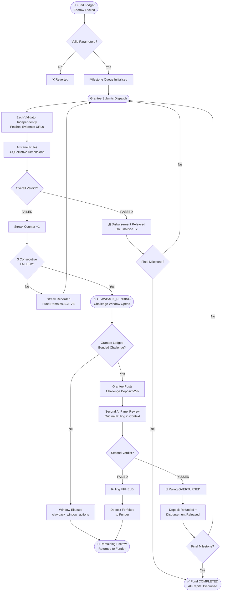

# Fiducia
> *Where grant promises meet on-chain proof.*

## Executive Summary
Fiducia is a trustless grant accountability protocol deployed on GenLayer. It uses tranched escrow and independent AI validators to evaluate grantee dispatches before releasing funds.

## Architecture

